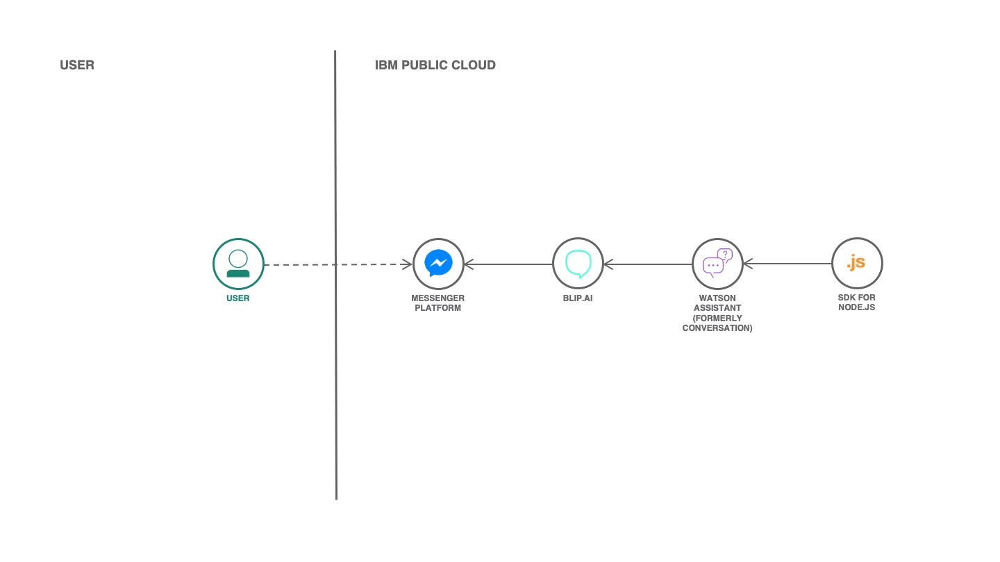

# Connect your Watson Assistant to Facebook Messenger with Blip.ai

[](https://bluemix.net)
[](https://developer.ibm.com/node/)

This application allows you to connect your chatbot with [Watson Assistant](https://www.ibm.com/cloud/watson-assistant/) to [Facebook Messenger](https://developers.facebook.com/) using [Blip](https://blip.ai/) platform. If you don't know how to train a new chatbot, checkout the [blog](https://medium.com/ibmdeveloperbr/watson-assistant-como-criar-o-seu-chatbot-usando-skills-e-assistants-755b4677984b/).



## Components and technologies

* [SDK for Node.js](https://cloud.ibm.com/catalog/starters/sdk-for-nodejs): Develop, deploy, and scale server-side JavaScript® apps with ease on IBM Cloud Foundry. The IBM SDK for Node.js™ provides enhanced performance, security, and serviceability.
* [Node.js](https://nodejs.org/): Node.js® is a JavaScript runtime built on Chrome's V8 JavaScript engine.
* [React](https://reactjs.org): A declarative, efficient, and flexible JavaScript library for building user interfaces.
* [Blip.ai](https://blip.ai/): Create intelligent chatbots using the best AI solutions available in the market. To guide more specific users’ demands, integrate the bot to human service as well.

## Run locally

In order to deploy the code in a cloud platform, you need to install [Node.js](https://nodejs.org). After the installation, you can follow the steps below.

### 1. Download the source code

```sh
git clone https://github.com/victorshinya/connect-assistant-blip.git
cd connect-assistant-blip
```

### 2. Install all dependencies and build the app

```sh
npm install
npm run build
```

### 3. Run the app

```sh
npm start
```

### 5. Access the application on http://localhost:3000

## License

MIT License

Copyright (c) 2018 Victor Kazuyuki Shinya
